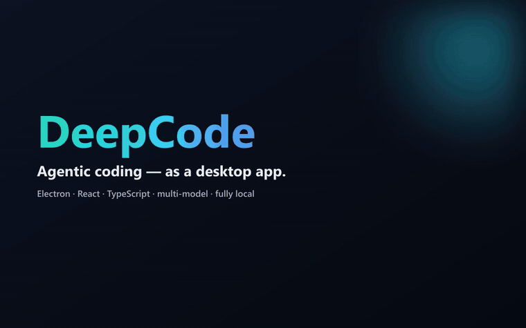
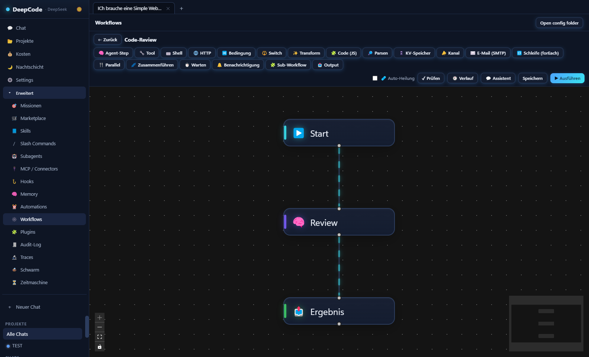
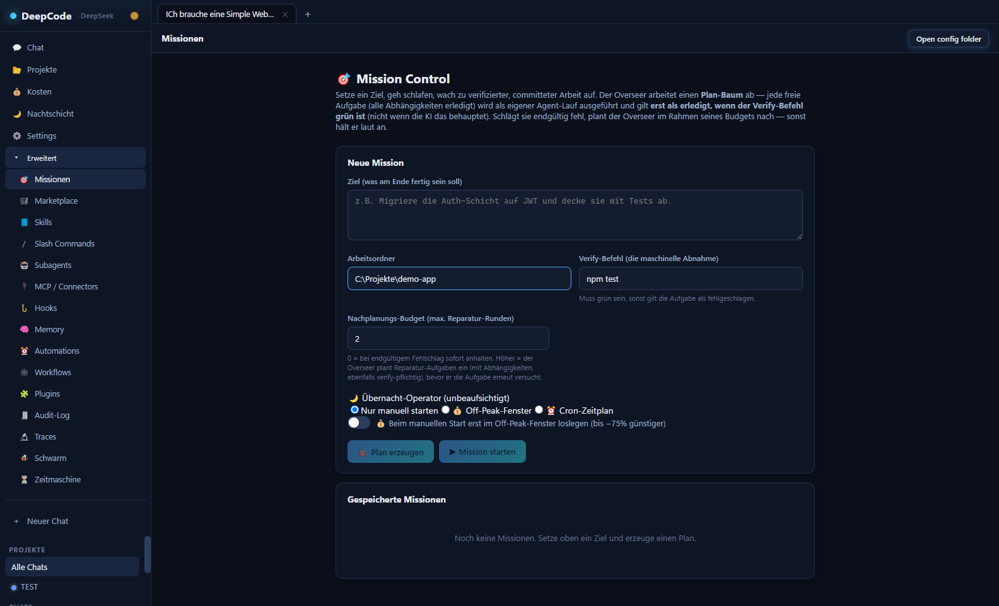
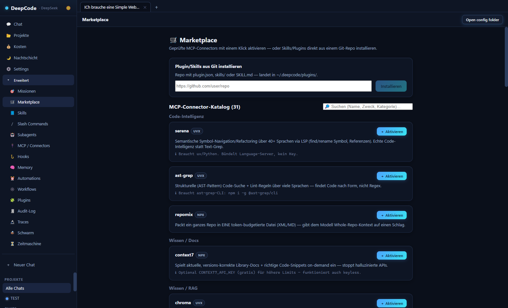
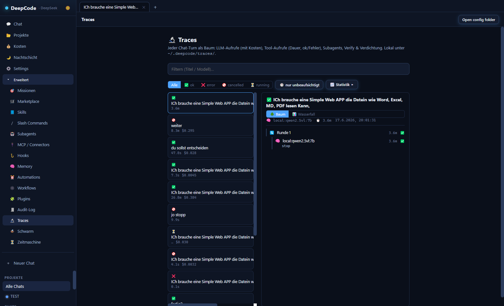

# DeepCode

> [🇬🇧 English](README.md) · 🇩🇪 Deutsch

**Ein agentischer Coding-Assistent als Desktop-App** — der nicht nur Code *vorschlägt*, sondern **handelt**: liest, schreibt und refactored Dateien über ein ganzes Projekt, führt Befehle und Tests aus, automatisiert Arbeit auf einer visuellen Canvas und kann autonome, verifizierte Missionen abarbeiten. Von Grund auf gebaut mit Electron, React und TypeScript; läuft gegen DeepSeek, lokale Modelle (Ollama / LM Studio) und andere OpenAI-kompatible Endpunkte — **komplett lokal und datenschutzfreundlich**.




<sub>Kurze Tour: visueller Workflow-Builder · Mission Control · Swarm · Zeitmaschine · Run-Traces · Kosten-Dashboard · MCP-Marketplace.</sub>

---

## Warum dieses Projekt spannend ist

Ein im Alleingang gebautes End-to-End-Produkt, das weit über einen Chat-Wrapper hinausgeht — die schwierigen Teile sind die Agenten-Laufzeit und das Sicherheitsmodell:

- **Echter Streaming-Tool-Calling-Loop** — mehrstufige Qualitäts-Runden, Token-/Kosten-Budget pro Turn, Context-Compaction und ein Freigabe-Gate mit drei Modi (Interaktiv / Plan / Auto).
- **Verifizierte Autonomie** — „Mission Control" arbeitet ein Ziel als Abhängigkeits-DAG ab und markiert eine Aufgabe **erst dann als erledigt, wenn ihr Verify-Befehl grün ist**, nie auf Zuruf der KI. Begrenzte Nachplanung statt Endlosschleifen.
- **Parallelität, die dein Repo nicht zerstört** — „Swarm" lässt N Agenten gleichzeitig laufen, jeder in einem **eigenen isolierten Git-Worktree + Branch**, mit hartem Kosten-Cap und garantiertem Aufräumen.
- **Mehrschichtiges Sicherheitsmodell** — Arbeitsverzeichnis-Confinement (symlink-sicher), SSRF-gehärteter Web-Fetch (DNS-Pinning + IPv6-Bypass-Blocking), ein „Unattended"-Gate, das risikoreiche Tools blockt, wenn kein Mensch anwesend ist, OS-verschlüsselte Secret-Verwaltung und abbruch-/timeout-gesicherte MCP-Aufrufe.
- **Solide gebaut, nicht zusammengehackt** — 394 Unit-/Integrationstests (inkl. Real-Git-Suiten für die Flagship-Orchestrierung), ESLint und eine CI-Pipeline, die die App **baut und jede Ansicht durch einen Playwright-UI-Smoke-Test** treibt.

> **Keine Secrets in diesem Repo.** API-Keys werden in den App-Einstellungen eingegeben und **OS-verschlüsselt** unter `~/.deepcode` gespeichert — nie im Quellcode, nie in `.env`. Diese öffentliche Kopie enthält keine Keys, Datenbanken oder Logs.

---

## Highlights

| Bereich | Was es kann |
| --- | --- |
| 🧠 **Agenten-Loop** | `read_file` / `write_file` / `edit_file` / `apply_patch`, Shell, Git, Web-Fetch, Subagents, sichtbare To-do-Liste, Streaming + Live-Kosten. |
| 🕸️ **Visueller Workflow-Builder** | n8n-artige Canvas, **20 Node-Typen** (Agent, Tool, Shell, HTTP, Bedingung, Schleife, E-Mail …), Cron- + Datei-Trigger, Self-Healing, „aus Beschreibung generieren", Ausführen-aus-Chat. |
| 🎯 **Mission Control** | Ziel setzen → autonome, verifizierte Abarbeitung eines Plan-Baums, mit Übernacht-/Off-Peak-Operator. |
| 🐝 **Swarm** | Parallele Agenten in isolierten Git-Worktrees + Branches; kosten-gedeckelt; Branches prüfen & mergen. |
| ⏳ **Zeitmaschine** | Vergangene Turns auf einer Zeitleiste scrubben und ab jedem Punkt einen neuen Branch abzweigen (kausaler Replay statt blindes Undo). |
| 🔬 **Run-Traces** | Jeder Turn als korrelierter Kosten-/Zeit-Baum + Wasserfall; Tokens pro Aufruf und ok/Fehler. |
| 🛒 **Marketplace** | Kuratierter **31-Connector**-MCP-Katalog, durchsuchbar, 1-Klick-Aktivierung; plus Plugins/Skills aus einem Git-Repo installieren. |
| 🧩 **Erweiterbar** | Datei-basierte Skills, Subagents, Hooks, Plugins, Slash-Commands, semantisches projekt-bezogenes Memory, geplante Automationen. |

| Visueller Workflow-Builder | Mission Control |
| --- | --- |
|  |  |
| **MCP-Marketplace** | **Run-Traces (Observability)** |
|  |  |

---

## Architektur

```
src/
  shared/    Typen + IPC-Kanalnamen (von allen Prozessen genutzt)
  main/      Electron-Main-Prozess
    agent/   Modell-Client, agentische Engine, Prompt-Builder, tools/
    systems/ Skills, Commands, Subagents, Hooks, Memory, MCP, Plugins, Automationen
    missions/ Mission-Overseer + Planer        timemachine/ Timeline + Fork + Reconstruct
    workflows/ Node-Executor, Trigger, Self-Heal
  preload/   contextBridge-API (window.deepcode)
  renderer/  React-UI (Chat, Streaming, Tool-Freigaben, alle Panels)
test/        vitest Unit- + Real-Git/Store-Integrationstests + Renderer-Tests (jsdom)
```

Drei-Prozess-Electron-App: eine typisierte IPC-Brücke verbindet einen React-Renderer mit einer Main-Prozess-Engine, die den Modell-Client, die Tool-Laufzeit und allen Datei-/Shell-Zugriff besitzt. Jede Fähigkeit (Skills, MCP, Hooks, Workflows …) ist datei-basiert und unter `~/.deepcode` editierbar.

## Tech-Stack

**Electron · React 18 · TypeScript · Vite (electron-vite) · React Flow** · markdown-it + highlight.js · Model Context Protocol (MCP) · Vitest · ESLint · Playwright · GitHub Actions.

## Qualität & CI

- **394 Tests** (vitest): reine Logik, Real-Git/Store-Integration (Swarm-Worktrees, Zeitmaschine, Mission-Overseer) und Renderer-Komponenten unter jsdom + Testing Library.
- CI führt **Lint → Typecheck → Test** aus und in einem zweiten Job wird **die App gebaut und der Playwright-UI-Smoke-Test** über jede Ansicht getrieben — ein Build-Bruch, ein Konsolenfehler oder eine kaputte View lässt CI fehlschlagen, nicht nur Unit-Regressionen.

```bash
npm run lint && npm run typecheck && npm test   # worauf CI gated
npm run smoke                                   # baut + treibt jede View (Playwright)
```

## Starten

```bash
npm install
npm run dev                     # Entwicklung mit Hot-Reload
# oder
npm run build && npm run start  # den Produktions-Build starten
npm run package:win             # Windows-Installer (NSIS) nach ./release bauen
```

Beim ersten Start in den **Einstellungen** den DeepSeek-API-Key + das Modell eintragen (oder ein lokales Ollama-/LM-Studio-Modell per `local:`-Präfix nutzen — kostenlos und offline). Keys werden OS-verschlüsselt gespeichert und landen nie in diesem Repo.

> Windows: `START_DEEPCODE.bat` ist ein Ein-Klick-Starter (baut, dann startet er).

## Status & Hinweise

Persönliches Projekt, in aktiver Entwicklung. Modell-ID und Base-URL sind konfigurierbar, sodass jeder OpenAI-kompatible „v4 PRO"-/lokale/DeepInfra-Endpunkt ohne Code-Änderung passt. Die UI-Texte sind aktuell auf Deutsch.

## Changelog

- **v0.2.88** — **Aktuellen Chat leeren.** Ein 🧹-Knopf leert die Nachrichten und Aufgaben des offenen Chats, behält aber die Session (Titel / Modell / Arbeitsverzeichnis) — mit Sicherheitsabfrage. Während eines laufenden Turns abgelehnt, damit nichts kollidiert.
- **v0.2.87** — **Aufgeräumte Modellauswahl.** Das Modell-Dropdown zeigt jetzt kuratierte, sortierte Anzeigenamen (z. B. „DI GLM 5.2", „OR Grok 4.3", „Lokal Qwen 2.5 uncensored") statt roher Slugs und unterscheidet dasselbe Modell über verschiedene Anbieter. Reine Anzeige — die gespeicherte Modell-ID bleibt unverändert.
- **v0.2.86** — **Übersichtlicherer Verlauf.** Die automatischen Selbst-Review-/Verify-/Verdichtungs-Nachrichten des Agenten werden jetzt als gemutete, beschriftete Auto-Notizen angezeigt statt wie eine eigene Nutzernachricht (gehen weiterhin ans Modell). Uhrzeit unter jeder Nachricht ergänzt und eine fälschliche „Modell hängt evtl."-Warnung behoben, während tool-lastige Modelle ihre Tool-Argumente streamen.
- **v0.2.85** — **Flaggschiff-Modelle über OpenRouter.** Grok 4.3, MiniMax M3 und Kimi K2.7 Code als Ready-Picks ergänzt — jeweils gegen die Live-OpenRouter-API verifiziert (exakter Slug, Kontextfenster, Preis, natives Tool-Calling).
- **v0.2.84** — **OpenRouter-Kostengenauigkeit + Modellauswahl.** Per-Modell-Fallback-Raten für jeden OpenRouter-Pick, damit ein Turn nie fälschlich $0 zeigt, falls der Live-Kostenwert fehlt; `:free`-Routen werden als echt kostenlos behandelt. Gemini 2.5 Flash-Lite als Ready-Pick ergänzt; MiMo läuft jetzt ausschließlich über die günstigere OpenRouter-Route.
- **v0.2.83** — **OpenRouter-Provider.** Ein neues `openrouter:`-Präfix routet zu OpenRouter (ein Key, hunderte Modelle). Die Kosten kommen aus OpenRouters eigenem gemeldeten Wert, stimmen also mit der echten Abrechnung überein. Mit Ready-to-Pick-Modellen — u. a. dasselbe MiMo deutlich günstiger über OpenRouter, dazu tool-fähige Picks wie GLM-4.7-Flash, DeepSeek-V4-Flash, Qwen3-Coder-Flash, Grok-4.1-Fast, gpt-oss-20b und das kostenlose gpt-oss-120b. Keys bleiben in der OS-verschlüsselten Konfiguration, nie im Quellcode.
- **v0.2.82** — **Exakte Kostenerfassung.** Die Kosten pro Turn nutzen jetzt den vom Anbieter gemeldeten Wert (DeepInfras `estimated_cost`), sodass die Anzeige der echten Rechnung entspricht — mit einer recherchierten Per-Modell-Preistabelle (inkl. cached-Input) als Fallback statt einer einzigen Pauschale für alle DeepInfra-Modelle. Liest zudem OpenAI-konforme Cache-Token, bepreist Gateway-Routen nach dem tatsächlichen Zielmodell und verrechnet unbekannte Modelle nicht mehr zu falschen Raten.
- **v0.2.81** — **Hänger-sicheres Streaming + Live-Schrittansicht.** Der Modell-Stream hat jetzt Connect- und Idle-Timeouts: Wenn ein Anbieter stockt (lokales Modell lädt, Reasoner hängt, Gateway unter Last), bricht es mit klarer Meldung ab statt ewig zu hängen. Eine neue Aktivitäts-Anzeige im Stil von Claude Code/Codex zeigt den aktuellen Schritt, das laufende Tool und die verstrichene Zeit — plus ein „Zeit seit letzter Aktivität"-Heartbeat, der bei Stillstand auf eine Warnung umschaltet. So sehen *arbeitet* und *hängt* endlich unterschiedlich aus.
- **v0.2.80** — **Chats in der Seitenleiste umbenennen.** Ein sichtbarer Stift-Button (neben dem Löschen) macht das bereits vorhandene Inline-Umbenennen (Doppelklick / F2) auffindbar; ein manuell gesetzter Titel ist jetzt vor dem automatischen Titel aus der ersten Nachricht geschützt.
- **v0.2.79** — **Den laufenden Turn steuern.** Eine Nachricht, die du sendest, während der Agent arbeitet, wird jetzt in den *aktuellen* Turn am nächsten Schritt eingespeist — der Agent korrigiert sofort den Kurs, statt deine Eingabe bis zum Turn-Ende in die Warteschlange zu stellen.
- **v0.2.78** — Zwei weitere DeepInfra-Ready-Picks: **Qwen3-Coder-480B** (agentisches Coden) und **Kimi K2.6** (agentisch, Function-Calling).
- **v0.2.77** — **Xiaomi MiMo** läuft jetzt standardmäßig über **DeepInfra** (`deepinfra:XiaomiMiMo/MiMo-V2.5-Pro`) — ein Key dafür; Xiaomis Gratis-Token-Plan bleibt als Alternative.
- **v0.2.76** — Der Agent **kommentiert jetzt seine Arbeit** — ein kurzer Satz vor jeder Aktion und ein Fazit danach, wie Claude Code / Codex.
- **v0.2.72–0.2.75** — Neue Modell-Provider & Ready-Picks: **Xiaomi MiMo** (`mimo:`) und das **Kilo-Code-Gateway** (`kilo:`), dazu **GLM-5.2** und **Gemma 4 31B** (DeepInfra) sowie **JetBrains Mellum 2** (lokal).
- **v0.2.68** — Jeder **MCP-Aufruf ist abbruch- + timeout-gesichert** — ein hängender Connector friert keinen Turn mehr ein (Stop unterbricht sofort).
- **v0.2.64–0.2.67** — CI gehärtet (**Build + Playwright-UI-Smoke + ESLint**); der Engine-Freigabe-Gate und der DeepSeek-Client extrahiert und unit-getestet.
- **v0.2.60–0.2.63** — **Multi-Session-Tabs** (Horizontal-Scroll + Drag-Reorder), ausklappbares **Diff pro Tool-Span** im Traces-Panel, ein Time-Machine-Reconstruct-Test und ein **Renderer-Test-Fundament** (jsdom + Testing Library).

<sub>Neueste zuerst · bei jedem Release aktualisiert.</sub>

## Lizenz

[MIT](LICENSE) © Maurice
